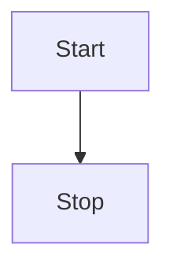

# vitepress-plugin-mermaid2

Add mermaid support for Vitepress.
It detects any dark theme that are set in body as long as it has dark in the name


## Install

npm
```bash
npm i vitepress-plugin-mermaid2 mermaid -D
```
pnpm
```bash
pnpm install vitepress-plugin-mermaid2 mermaid -D 
```

## Setup it up

Add wrapper

```js
// .vitepress/config.js
import { withMermaid } from "vitepress-plugin-mermaid2";

export default withMermaid({
  // your existing vitepress config...
  mermaid:{
    //mermaidConfig !theme here works for light mode since dark theme is forced in dark mode
  },
  ...
});
```

Use in any Markdown file

````md
<!---any-file.md-->


````
